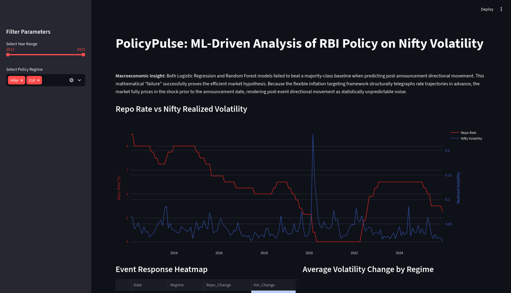
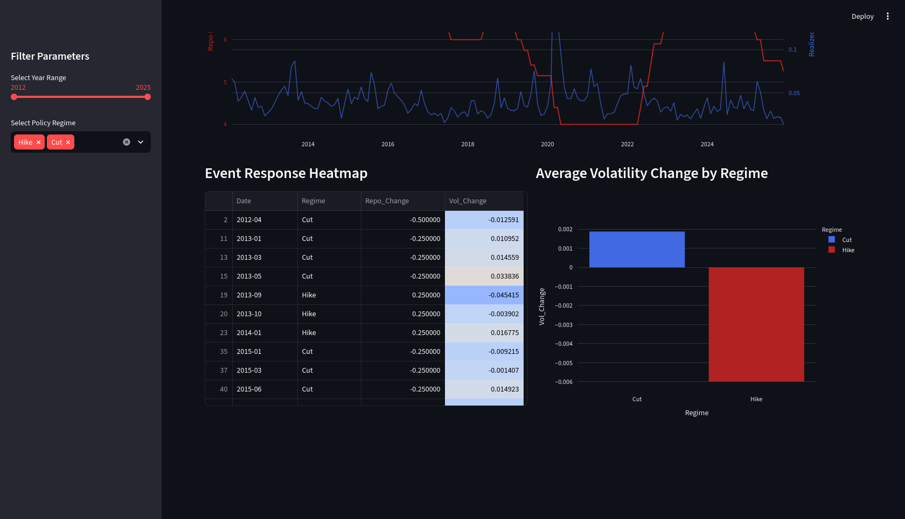

# PolicyPulse: RBI Repo Shocks and Nifty Volatility Regimes

A complete end-to-end macro-finance and data-science project studying how RBI repo-rate changes relate to Nifty 50 volatility from 2012 to 2025.


[](./app.py)
[](./app.py)

## Project Summary

This repository brings together policy data, market data, and quantitative analysis to answer a focused question:

> Are RBI repo-rate changes informative about future volatility regimes in the Indian equity market, and can they improve short-horizon prediction beyond simple persistence-based baselines?

The work combines data preparation, exploratory analysis, event studies, model benchmarking, and a GJR-GARCH volatility framework. The final conclusion is that repo-rate moves are informative about regime context and market conditions, but they are not strong enough on their own to produce precise short-term forecasting power. Volatility persistence and market structure dominate the dynamics.

## Final Repository Status

This project is complete and includes:

- a reproducible data preparation pipeline
- an exploratory analysis notebook
- an interactive Streamlit dashboard
- a formal written report with methodology and results
- prepared data files for downstream analysis

## Repository Structure

- `00_data_preparation.py` — prepares the master dataset by merging RBI repo-rate data with Nifty realized volatility.
- `01_analysis.ipynb` — contains the main exploratory work, event-study analysis, predictive benchmarking, and volatility modeling.
- `app.py` — Streamlit application for visual exploration of repo-rate and volatility dynamics.
- `REPORT.md` — final narrative report summarizing the research and conclusions.
- `data/` — cleaned and processed datasets used across the project.
- `requirements.txt` — Python dependency list.

## Data and Methodology

### Data Sources

- RBI repo-rate records from the official RBI data portal
- Nifty 50 daily market data from Yahoo Finance using `yfinance`

### Core Workflow

1. Load RBI repo-rate records and standardize dates.
2. Resample the policy series to month-end frequency using forward fill.
3. Download Nifty 50 daily data and compute daily log returns.
4. Convert daily returns to monthly realized volatility using a 21-trading-day scaling factor.
5. Merge policy and market data into a monthly benchmark dataset.
6. Run exploratory statistics, event studies, predictive benchmarks, and GJR-GARCH analysis.

## Analyses Included

### 1. Exploratory Relationship Analysis

- measurement of correlation between repo-rate changes and realized volatility
- interpretation of policy versus market regime dynamics

### 2. Event-Study Analysis

- comparison of volatility before and after hikes and cuts
- abnormal volatility analysis around policy decisions

### 3. Prediction Benchmarks

- naive persistence benchmark
- Logistic Regression and Random Forest comparisons
- walk-forward validation to preserve temporal ordering

### 4. Volatility Modeling

- GJR-GARCH applied to daily Nifty returns
- analysis of persistence, asymmetry, and heavy-tailed behavior

## Main Findings

The final evidence from the project is consistent across methods:

- Repo-rate changes display a moderate inverse relationship with subsequent realized volatility.
- Cuts are associated with elevated pre-event volatility and normalization after the policy move.
- Hikes often occur in calmer volatility environments.
- Volatility regimes are highly persistent and typically outperform policy-based models in short-horizon prediction.
- Standard machine learning models do not reliably beat naive persistence baselines.
- GJR-GARCH confirms strong clustering, asymmetry, and fat-tailed behavior in Nifty returns.

### Overall Interpretation

RBI policy is most informative as a regime and context indicator rather than as a standalone short-horizon forecasting signal. The project shows that Nifty volatility is driven substantially by its own persistence and market structure, while repo-rate actions provide useful but not dominant explanatory power.

## How to Run the Project

### 1. Install dependencies

```bash
pip install -r requirements.txt
```

### 2. Prepare the master dataset

```bash
python 00_data_preparation.py
```

### 3. Explore the analysis

Open and run the notebook in `01_analysis.ipynb`.

### 4. Launch the dashboard

```bash
streamlit run app.py
```

## Project Outputs

- `data/master_data.csv` — combined monthly RBI and Nifty dataset
- `data/rbi_rates.csv` and `data/rbi_rates_raw.csv` — source policy data
- `REPORT.md` — detailed project report
- `app.py` — interactive policy and volatility dashboard

## Final Assessment

This project is a complete, evidence-based macro-finance study. It demonstrates a realistic workflow for turning policy data and market prices into a coherent analytical narrative, and it reaches careful conclusions instead of overpromising predictive power. The repository is intentionally framed as a benchmark study of policy-volatility interaction, not as a claim of a highly predictive trading model.
